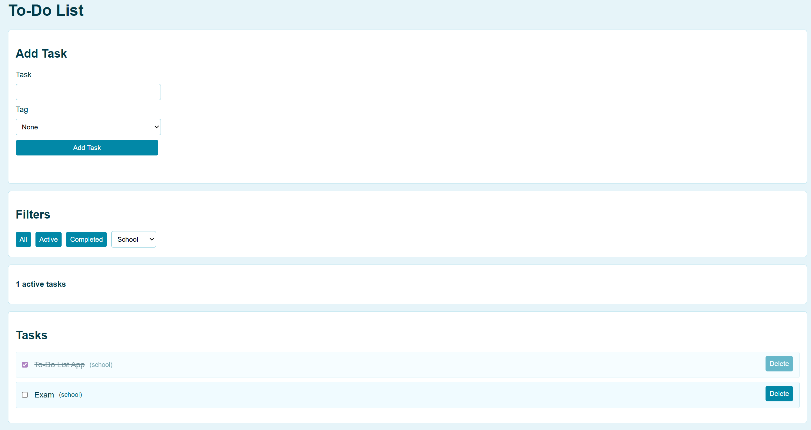

# To-Do List App

This project is a simple to-do list web app built for a web scripting assignment.

## Features

- Add tasks with an optional tag (school, work, personal)
- Display tasks in a list
- Mark tasks as complete
- Delete tasks
- Filter tasks by:
    - Tag
    - All
    - Active
    - Completed
- Persistent storage using localStorage (tasks remain after refresh)
- Input validation with error messages
- Active task counter

## Technologies Used

- HTML5
- CSS
- JavaScript

## Functionality

- Tasks are stored as objects in an array
- The app saves and loads tasks using localStorage
- The task list is rendered using JavaScript
- Filters update the displayed tasks without changing the stored data

## Screenshot

