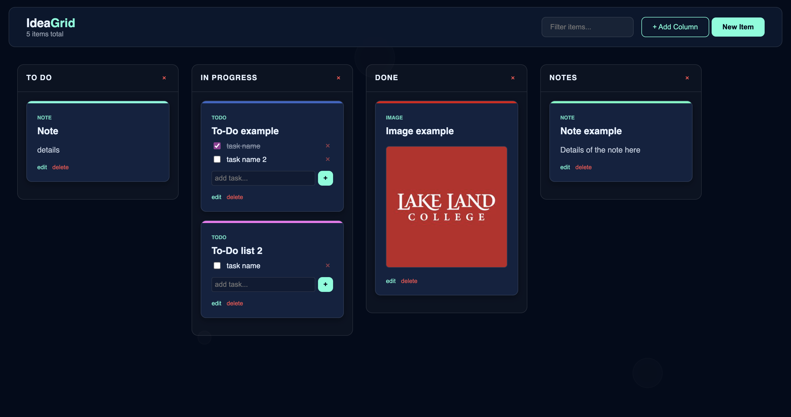

# Grid Board Project for Webscripting Final

This project is a dynamic, browser-based Kanban board designed for organizing notes, to-do lists, and images using a column-based layout.

## Features

- **Dynamic Column Management**: Create and delete custom columns for different workflow stages.
- **Multi-Type Cards**: Support for standard notes, image-linked cards, and interactive todo lists.
- **Drag-and-Drop System**: Move cards between columns or reorder the columns themselves using the header handles.
- **Persistent Storage**: Uses LocalStorage to save your board state between sessions.
- **Real-time Search**: Filter through cards instantly based on titles or descriptions.
- **Responsive Design**: Mobile-friendly layout with a water themed bubble background animation.

## Technologies Used

- HTML5
- CSS
- JavaScript

## Screenshot
